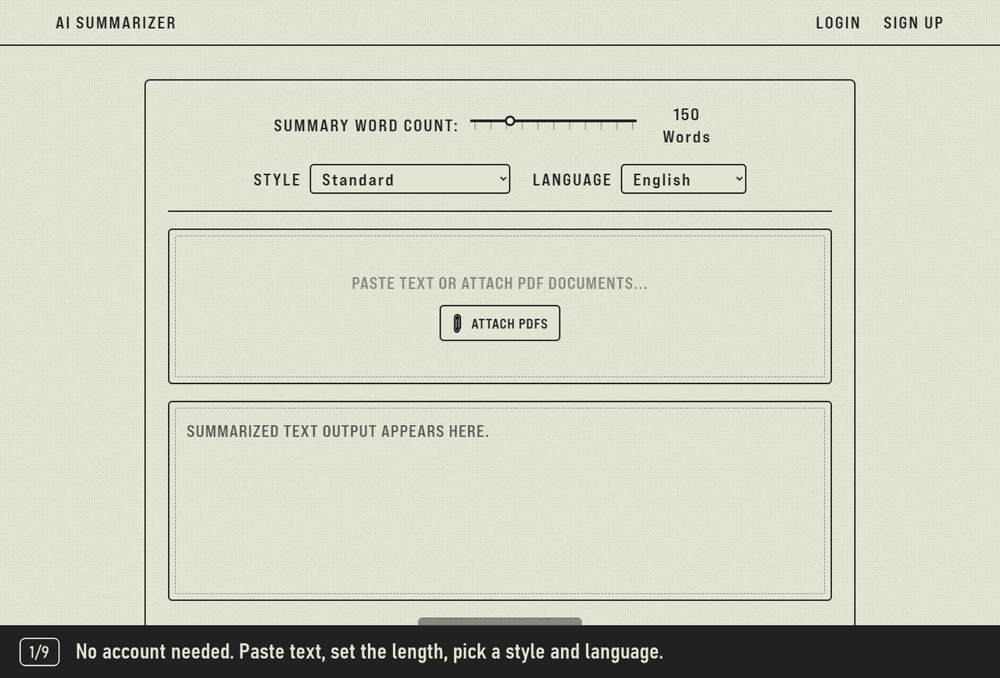
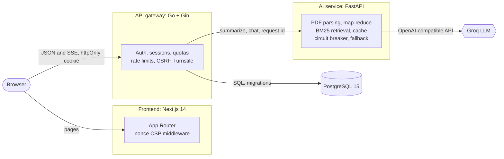
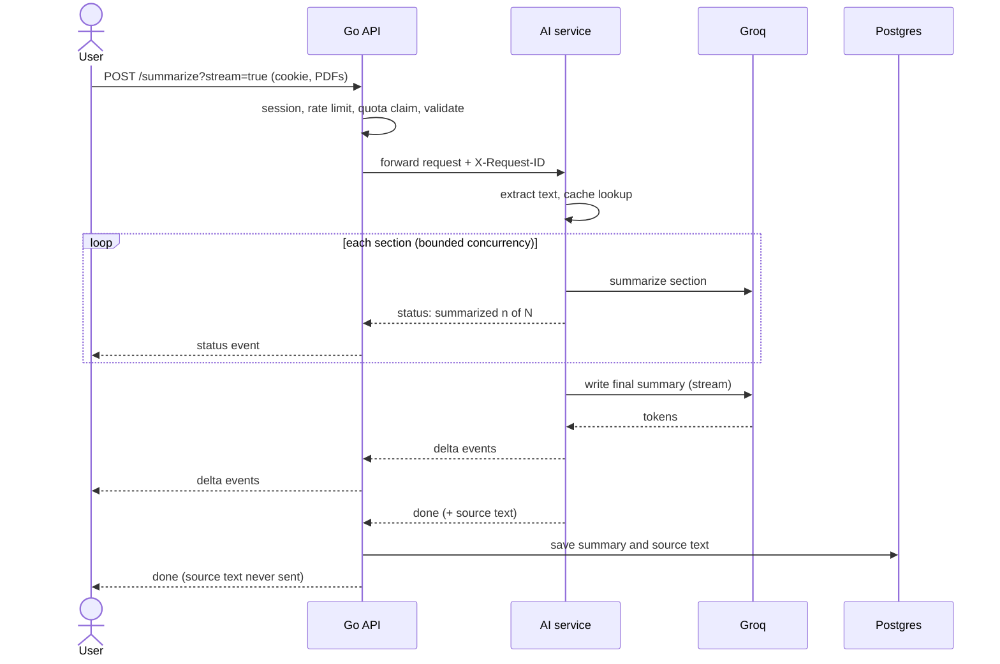

<div align="center">

# AI Document Summarizer

**Summarize PDFs and text in seconds, watch the answer stream in live, then chat with your documents.**

A full-stack, three-service application with an e-ink inspired interface: a Next.js frontend, a Go API gateway, and a Python AI service, backed by PostgreSQL.

[](https://github.com/Oblutack/Ai-Summarizer/actions/workflows/ci.yml)
[](LICENSE)


[**Live demo**](https://ai-summarizer-ten-tan.vercel.app) &nbsp;·&nbsp; [Features](#features) &nbsp;·&nbsp; [Quick start](#quick-start) &nbsp;·&nbsp; [Architecture](#architecture) &nbsp;·&nbsp; [API](#api-reference) &nbsp;·&nbsp; [Configuration](#configuration) &nbsp;·&nbsp; [Testing](#testing)

<br>



<sub>Logging in, attaching two PDFs, streaming an executive brief, and asking the saved document a question.</sub>

</div>

---

## Features

### Summarization
- **PDF or pasted text.** Drop in up to **5 PDFs** (10 MB each) and get one combined summary that calls out overlaps and differences between them.
- **Live streaming.** Words appear as the model writes them, with real progress ("Summarized 3 of 8 sections") for long documents, and a Cancel button that actually stops the work.
- **Five styles and 15 languages.** Standard, bullet points, executive brief, explain-it-simply, or takeaways with action items, in any of 15 output languages regardless of the source language.
- **Length control.** A word-count slider for short summaries, or a page limit for long documents.
- **Handles long documents.** Anything too big for one prompt goes through a map-reduce pipeline: sections are summarized in parallel (with bounded concurrency), then combined.
- **Instant repeats.** Identical requests (same text, options, model and prompt version) are answered from an in-memory cache.

### Chat with your documents
- Ask questions about any saved summary. The original text is kept server-side, and for long documents a built-in BM25 search picks only the relevant passages for the model, so answers stay grounded and cheap.
- Conversation history is supported, and the model is told to say so when the answer is not in the document.

### Accounts and privacy
- Email/password (bcrypt) and **Google sign-in**, with email confirmation and password reset.
- **Revocable server-side sessions** in `httpOnly` cookies; a device list with remote sign-out; "sign out everywhere".
- **Your data is yours:** one-click JSON export and permanent account deletion (hard delete, re-authenticated).
- Saved history with cursor pagination, PDF export, and daily usage meters.

### Built for production
- Per-user daily quotas (with refunds when work fails), per-IP and per-user rate limits, a per-account login throttle, and optional **Cloudflare Turnstile** bot protection.
- A circuit breaker and automatic model fallback so a provider outage or a retired model degrades gracefully instead of hanging.
- Structured JSON logs with a request ID that follows each request from the browser through the Go API into the AI service.
- Health and readiness endpoints, Docker health checks, non-root images, SQL migrations, and CI that runs every test suite against a real Postgres.

---

## Quick start

**Prerequisites:** [Docker](https://www.docker.com/), [Node.js 20+](https://nodejs.org/) with [pnpm](https://pnpm.io/), and a free [Groq API key](https://console.groq.com/keys).

```bash
# 1. Clone
git clone https://github.com/Oblutack/Ai-Summarizer.git
cd Ai-Summarizer

# 2. Configure the backend (Postgres password, Groq key, Google client ID)
cp .env.example .env
#    edit .env: set POSTGRES_PASSWORD, GROQ_API_KEY and GOOGLE_CLIENT_ID

# 3. Start Postgres, the AI service and the Go API
docker compose up --build

# 4. Start the frontend (in a second terminal)
cd frontend
printf 'NEXT_PUBLIC_API_URL=http://localhost:8080\nNEXT_PUBLIC_GOOGLE_CLIENT_ID=<your-client-id>\n' > .env.local
pnpm install
pnpm dev
```

Open **http://localhost:3000**. Compose waits for each service's health check, so the first start takes a minute while images build.

<details>
<summary><b>Notes for first-time setup</b></summary>

- **Google client ID.** Compose requires `GOOGLE_CLIENT_ID` to be set. To try the app without Google sign-in, any placeholder value works (the Google button will simply not complete); to enable it, create an OAuth client at [Google Cloud Console](https://console.cloud.google.com/apis/credentials) with `http://localhost:3000` as an authorized JavaScript origin.
- **Email links.** With the default `MAIL_PROVIDER=log`, confirmation and reset emails are not sent: their links are printed to the API log (`docker logs go-api`). See [Email](#email) to send real mail.
- **Existing database volume.** If you previously ran an older version and `go-api` cannot authenticate, your Postgres volume still has the old password. Either set `POSTGRES_PASSWORD` to the old value or run `docker compose down -v` to start fresh (this deletes local data).

</details>

---

## Architecture



The browser only ever talks to the Go gateway. It owns identity and persistence and treats the AI service as an internal, stateless dependency, so the model provider can change without touching accounts or data.

<details>
<summary><b>How a streamed summary flows</b></summary>



Failures before the first byte are ordinary JSON errors; once streaming has started they arrive as a final `error` event. The quota is refunded whenever the user did not receive a complete summary.

</details>

### Services

| Service | Stack | Responsibility |
| --- | --- | --- |
| [`frontend/`](frontend) | Next.js 14, TypeScript, Tailwind CSS, Framer Motion | UI, streaming reader, account pages, per-request CSP |
| [`go-api/`](go-api) | Go 1.24, Gin, GORM, pgx, golang-migrate | Auth and sessions, quotas, rate limits, proxying and streaming, persistence |
| [`python-ai-service/`](python-ai-service) | FastAPI, LangChain, pypdf, httpx | PDF text extraction, summarization pipeline, chat retrieval, LLM client |
| PostgreSQL | Postgres 15 | Users, sessions, documents, usage, email tokens |
| LLM | Groq (OpenAI-compatible), default `openai/gpt-oss-20b` | Language model, configurable with automatic fallback |

### Design decisions
- **A gateway in front of the AI service.** Authentication, quotas and persistence live in one place; the AI service stays stateless and horizontally scalable.
- **Server-side sessions instead of JWTs.** Logout, password change and account deletion take effect immediately because the server can revoke a session. Only a SHA-256 hash of each token is stored.
- **Server-sent events over WebSockets.** Streaming a one-way result needs nothing more, passes through proxies cleanly, and keeps the HTTP error semantics intact until the first byte.
- **BM25 instead of an embedding service for chat.** No extra infrastructure or cost, and strong enough for single-document question answering. A vector index is the natural next step for "ask across all my documents".
- **Fail closed where it matters.** If the bot check cannot reach Cloudflare, or the quota cannot be checked, the request is refused rather than waved through.

---

## API reference

All endpoints are served by the Go gateway on port `8080`. Authenticated routes use the session cookie (or `Authorization: Bearer <session token>` for scripts). State-changing browser requests must come from an allowed origin.

<details open>
<summary><b>Summaries</b></summary>

| Method | Path | Auth | Description |
| --- | --- | :-: | --- |
| `POST` | `/public/summarize` | none | Summarize one PDF (multipart `file`). Nothing is saved. |
| `POST` | `/public/summarize-multiple` | none | Summarize up to 5 PDFs (multipart `files`). |
| `POST` | `/public/summarize-text` | none | Summarize pasted text (`{"text": "..."}`). |
| `POST` | `/summarize`, `/summarize-multiple`, `/summarize-text` | session | Same, but the result is saved to the user's history. Counts against the daily quota. |
| `POST` | `/documents/:id/chat` | session | Ask a question about a saved document (`{"question", "history"}`). |
| `GET` | `/documents?limit=20&before=<id>` | session | List saved documents, newest first. The next cursor is in the `X-Next-Cursor` header. |
| `DELETE` | `/documents/:id` | session | Delete a saved document. |

Common parameters: `wordCount` (50-1000), `pageLimit` (0-20), `style` (`default`, `bullets`, `brief`, `simple`, `takeaways`), `language`. Add **`?stream=true`** to any summarize route to receive server-sent events:

```text
data: {"type":"status","stage":"summarizing","done":3,"total":8}
data: {"type":"delta","text":"## Overview\n"}
data: {"type":"done","filename":"report.pdf"}
```

</details>

<details>
<summary><b>Accounts and security</b></summary>

| Method | Path | Auth | Description |
| --- | --- | :-: | --- |
| `POST` | `/signup`, `/login`, `/auth/google` | none | Create an account / start a session. |
| `POST` | `/auth/forgot-password`, `/auth/reset-password` | none | Emailed, single-use, one-hour reset link. |
| `POST` | `/auth/verify-email` | none | Redeem an emailed confirmation token. |
| `GET` | `/auth/me` | session | The signed-in user. |
| `POST` | `/auth/logout`, `/auth/logout-all` | - / session | End this session / every session. |
| `GET`, `DELETE` | `/auth/sessions`, `/auth/sessions/:id` | session | List signed-in devices, sign one out. |
| `POST` | `/auth/change-password`, `/auth/resend-verification` | session | Change password (signs out other devices); resend confirmation. |
| `GET` | `/usage` | session | Today's usage against the daily quotas. |
| `GET` | `/account/export` | session | Download all of your data as JSON. |
| `DELETE` | `/account` | session | Permanently delete the account and its data. |

</details>

<details>
<summary><b>Operations</b></summary>

| Method | Path | Description |
| --- | --- | --- |
| `GET` | `/healthz` | Liveness: the process is up. |
| `GET` | `/readyz` | Readiness: database and AI service reachable (the AI service also checks that a model is available). |
| `GET` | `/options` | The supported summary styles and languages. |

</details>

---

## Configuration

Backend settings live in the root `.env` (see [`.env.example`](.env.example)); frontend settings in `frontend/.env.local`.

| Variable | Default | Purpose |
| --- | --- | --- |
| `POSTGRES_PASSWORD` | *required* | Database password. |
| `GROQ_API_KEY` | *required* | Language model access. |
| `GOOGLE_CLIENT_ID` | *required* | Google sign-in (any placeholder to skip). |
| `LLM_MODEL`, `LLM_FALLBACK_MODELS` | `openai/gpt-oss-20b`, `openai/gpt-oss-120b` | Primary model and ordered fallbacks; a retired model is skipped automatically. |
| `MAIL_PROVIDER` | `log` | `log`, `brevo` or `resend`. See [Email](#email). |
| `MAIL_FROM`, `BREVO_API_KEY`, `RESEND_API_KEY` | - | Sender and provider credentials. |
| `REQUIRE_EMAIL_VERIFICATION` | `false` | Require a confirmed email before summarizing. |
| `QUOTA_SUMMARIES_PER_DAY`, `QUOTA_CHAT_PER_DAY` | `50`, `200` | Daily limits per signed-in user (UTC day, `0` = unlimited). |
| `TURNSTILE_SECRET` | empty (off) | Enables the Cloudflare Turnstile check. Pair with `NEXT_PUBLIC_TURNSTILE_SITE_KEY` in the frontend. |
| `COOKIE_SECURE`, `COOKIE_SAMESITE`, `COOKIE_DOMAIN` | `false` (compose), `lax` | Session cookie attributes. See [Deployment](#deployment). |
| `CORS_ALLOWED_ORIGINS`, `FRONTEND_URL` | `http://localhost:3000` | Allowed browser origins and the base URL of emailed links. |
| `TRUSTED_PROXIES` | unset | CIDRs of your reverse proxy, so client IPs (and rate limits) cannot be spoofed. |
| `LOG_FORMAT`, `LOG_LEVEL` | `json`, `info` | Structured logging. `LOG_FORMAT=text` is easier to read locally. |
| `SUMMARY_CACHE_SIZE`, `SUMMARY_CACHE_TTL_SECONDS` | `256`, `3600` | In-memory summary cache (`0` disables). |
| `LLM_BREAKER_THRESHOLD`, `LLM_BREAKER_COOLDOWN_SECONDS` | `5`, `30` | Circuit breaker around the LLM provider. |

Frontend: `NEXT_PUBLIC_API_URL` (the gateway, e.g. `http://localhost:8080`), `NEXT_PUBLIC_GOOGLE_CLIENT_ID`, and optionally `NEXT_PUBLIC_TURNSTILE_SITE_KEY`.

### Email

Verification and password-reset links go through a small provider interface. `log` (the default) prints links to the API log so the whole flow works locally with no account.

| Provider | Free tier | Notes |
| --- | --- | --- |
| [Brevo](https://www.brevo.com/) | 300 emails/day | Can start from a single verified sender address; a domain improves deliverability (Gmail senders are discouraged). |
| [Resend](https://resend.com/) | 3,000/month, 100/day | Simple API; needs a verified domain. |

Check each provider's current terms when you sign up.

---

## Testing

The project has **250+ automated tests** across the three services, all run in CI on every push and pull request.

```bash
# Go: unit tests (integration tests are skipped without a database)
cd go-api && go test ./...

# Go: add the Postgres integration tests (migrations, sessions, quotas, CSRF, account deletion)
createdb summarizer_test    # the database name must contain "test": its schema is wiped
TEST_DSN="host=localhost port=5433 user=user password=... dbname=summarizer_test sslmode=disable" go test -race ./...

# Python
cd python-ai-service
pip install -r requirements.txt -r requirements-dev.txt
pytest

# Frontend
cd frontend && pnpm lint && pnpm build
```

What is covered, beyond the happy paths: concurrency (a quota of 3 admits exactly 3 of 12 simultaneous requests), single-use tokens under races, session revocation, CSRF and CORS, streaming edge cases (failures mid-stream, large events, cancellation), migrations applied to a legacy-shaped database, circuit-breaker state transitions, and log hygiene (no query strings, bodies or recipient addresses in logs).

---

## Security

| Area | Measure |
| --- | --- |
| Sessions | Random 256-bit tokens in `httpOnly` cookies, only a hash stored; 30-day sliding expiry with a 90-day hard limit; revoked on logout, password change, reset and account deletion. |
| Passwords | bcrypt, 8-72 characters, common-password blocklist, equal-time comparison for unknown users, per-account login throttle. |
| CSRF | `Origin` check on every state-changing request, strict credentialed CORS allowlist, `SameSite` cookies. |
| Injection and XSS | Parameterized SQL only; nonce-based Content-Security-Policy with `strict-dynamic`; the API serves a `default-src 'none'` CSP. |
| Abuse | Per-IP and per-user rate limits, atomic daily quotas, optional Turnstile, request and upload size caps. |
| Privacy | Source text never returned to clients; logs contain route patterns and IDs, not content; one-click export and hard deletion. |
| Containers | Non-root users; the Go API ships as a static binary in a `scratch` image with nothing else in it; health checks on every service. |
| Dependencies | Versions pinned in `go.sum`, `pnpm-lock.yaml` and `requirements.txt`. |

To report a vulnerability, please open a private security advisory on GitHub instead of a public issue.

---

## Deployment

The backend is a standard 12-factor stack: build the `go-api` and `python-ai-service` images, provide a Postgres database, and set the environment variables above. The frontend is a standard Next.js app (for example on Vercel).

**Frontend and API on different sites** (for example `vercel.app` and `onrender.com`): set `COOKIE_SECURE=true`, `COOKIE_SAMESITE=none`, `CORS_ALLOWED_ORIGINS` and `FRONTEND_URL` to the frontend origin, and `TRUSTED_PROXIES` to your proxy's CIDRs. Browsers that block third-party cookies (Safari, Firefox) will not keep a login across two unrelated domains, so for production put both under one parent domain (`app.example.com` and `api.example.com`) and use `COOKIE_SAMESITE=lax` with `COOKIE_DOMAIN=.example.com`.

Schema changes are SQL migrations in [`go-api/migrations/`](go-api/migrations), applied automatically on startup under an advisory lock, so several instances can start at once.

---

## Project structure

```text
.
├── frontend/                 Next.js app (App Router)
│   ├── app/                  Pages: dashboard, account, login, signup, reset, verify
│   ├── components/           UI, including summarizer/ (form, input, output panels)
│   ├── hooks/useSummarizer   Streaming client state machine
│   ├── lib/                  API helper, SSE reader, markdown and PDF export helpers
│   └── middleware.ts         Per-request nonce Content-Security-Policy
├── go-api/
│   ├── server/               Router: every route and the middleware in front of it
│   ├── controllers/          Handlers: auth, account, summaries, chat, streaming proxy
│   ├── middleware/           Sessions, CSRF, quotas, rate limits, Turnstile, logging
│   ├── auth/                 Tokens, sessions, cookies, single-use email tokens
│   ├── mailer/               log / Brevo / Resend providers and email templates
│   ├── migrations/           Embedded SQL migrations
│   └── testutil/             Per-package Postgres schemas for integration tests
├── python-ai-service/
│   ├── main.py               Endpoints and the summarization pipeline
│   ├── llm.py                Model verification, fallback, circuit breaker
│   ├── prompts.py            Styles, languages, prompt construction
│   ├── retrieval.py          BM25 chunk retrieval for chat
│   ├── cache.py              Summary cache
│   └── logging_setup.py      JSON logs and request IDs
├── docs/demo.gif
└── docker-compose.yml
```

---

## Contributing

Issues and pull requests are welcome. Before opening a PR, please make sure all three suites pass (`go test ./...`, `pytest`, `pnpm lint && pnpm build`). Commits follow [Conventional Commits](https://www.conventionalcommits.org/) (`feat:`, `fix:`, `docs:`, `test:`, `chore:`).

## License

Released under the [MIT License](LICENSE).
